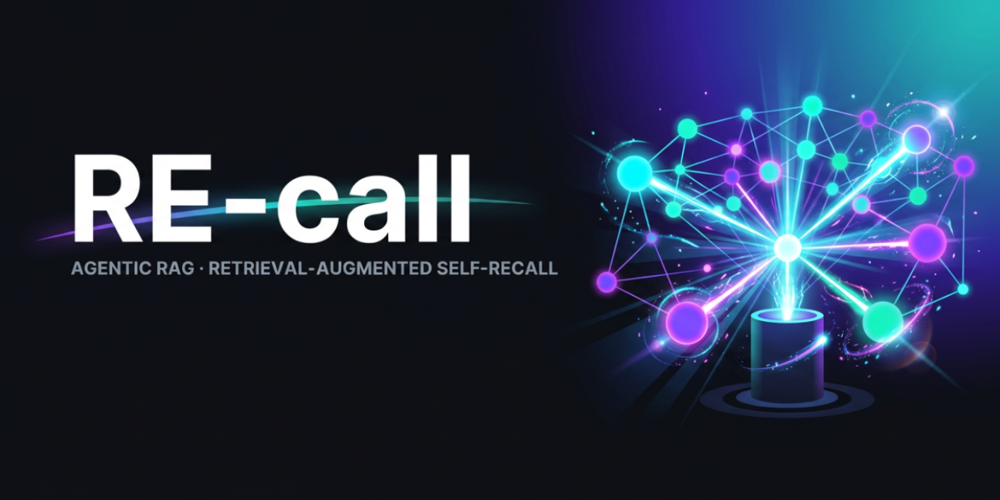
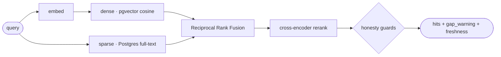
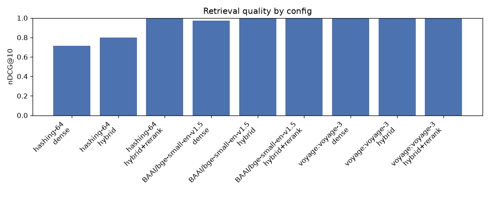

<p align="center">
  
</p>

<p align="center">
  RAG for an AI agent's own memory — that <i>knows when it doesn't know</i>.
</p>

<p align="center">
  <a href="https://github.com/GiulioDER/RE-call/actions/workflows/ci.yml"></a>
  <a href="LICENSE"></a>
  
  
</p>

<p align="center">
  <a href="docs/CASE_STUDY.md"><b>📄 Real-world usage →</b></a>
  &nbsp;·&nbsp;
  <a href="docs/USING_WITH_CLAUDE.md">Use with Claude</a>
  &nbsp;·&nbsp;
  <a href="docs/WRITEUP.md">Engineering writeup</a>
  &nbsp;·&nbsp;
  <a href="#-quickstart-2-minutes-no-api-key">Quickstart</a>
</p>

---

A long-running agent piles up memory — decisions, closed experiments, incident notes. Two failure
modes follow: it **re-litigates settled decisions**, and it **hallucinates over gaps** where the
memory simply has no answer.

**RE-call** is a RAG engine for that memory, built to be *honest about what it doesn't know*: it
retrieves **before** the agent acts, and flags when the memory probably has no answer instead of
returning confident noise.

## ✨ What it does

- 🕳️ **Gap-aware** — when the best match is weak, it returns a `gap_warning` (*"probable corpus gap — treat as noise"*) instead of hallucinating an answer.
- ⏱️ **Freshness-aware** — every result reports how stale the index is, so a rotting memory warns instead of silently serving old facts.
- 🔁 **Anti-re-litigation** — meant to be queried *before* re-proposing an idea, so closed decisions and falsified hypotheses resurface first.
- 🧱 **Production-shaped** — PostgreSQL + pgvector, hybrid dense + full-text retrieval fused with RRF, cross-encoder reranking, and an MCP server. Integration-tested on a real database.

## 🧭 How it works



Dense semantic search and sparse keyword search each retrieve candidates; **Reciprocal Rank Fusion**
merges them, a cross-encoder reranks, and the **honesty guards** annotate the result before it ever
reaches the agent.

## ⚡ See it work

```text
$ python -m recall.cli demo
indexed 3 chunks from 3 files

[ok]  query='what did we decide about caching?'
  0.736  corpus/decisions.md   '# Decisions  ## 2026-05-02 — Caching layer We decided to add a read-th…'

[ok]  query='do we inject retrieved context into the prompt?'
  0.809  corpus/hypotheses.md  '# Hypotheses  ## H-014 — Prompt-injected context improves answers (CLO…'

[GAP] query='how do we handle penguins on mars?'
  0.468  corpus/decisions.md   '# Decisions  ## 2026-05-02 — Caching layer We decided to add a read-th…'
```

The two answerable queries return strong hits (**0.74**, **0.81**). The deliberately-unanswerable one's
*best* match is only **0.468 — below the 0.50 gap threshold** — so it's flagged **`[GAP]`** instead of
handing back that irrelevant chunk as if it were an answer. That single flag is the whole thesis.

## 📊 Results that matter

A reproducible ablation harness scores every `embedder × fusion` config on a labelled query set —
precision@k, recall@k, MRR, nDCG, and a guard-specific **false-confident rate**.

<p align="center">
  
  &nbsp;
  
</p>

Two **honest** findings — including what *didn't* work:

- 🎯 **The gap threshold doesn't transfer across embedders.** The default `0.50` gives a **0.80**
  false-confident rate on FastEmbed (its cosines cluster high); per-embedder calibration to `~0.70`
  makes the guard perfect. → *Calibrate against a small labelled set; don't hard-code.*
- 🔁 **Reranking rescues a weak embedder.** Hybrid + cross-encoder lifts MRR **0.68 → 1.00** on the
  offline embedder — but a strong embedder already saturates this corpus, so the gain is real yet
  situational.

> Full methodology, per-embedder tables, and a *fine-tuning null result* (base model already
> saturated) → **[results/FINDINGS.md](results/FINDINGS.md)** and the **[engineering writeup](docs/WRITEUP.md)**.

✅ **46 integration tests run against a real pgvector container** (no mock DB), verified in CI, with a
dependency audit.

## 🏭 Where this comes from

RE-call isn't a toy — it's extracted from the memory system I run for a **production trading-research
agent** whose own memory outgrew its context window: **≈660 typed markdown memos (~5 MB), re-indexed
daily.** Every guard here is a scar from a real failure — re-litigating an already-falsified
experiment, trusting weak hits on a question the memory couldn't answer, serving a stale fact.

**→ [Read the redacted case study](docs/CASE_STUDY.md)** — the real structure, the guards in action,
and exactly what's public vs private.

## 🚀 Quickstart (≈2 minutes, no API key)

```bash
git clone https://github.com/GiulioDER/RE-call && cd RE-call
docker compose up -d --wait          # Postgres + pgvector (waits until healthy)
python -m venv .venv && . .venv/bin/activate    # Windows: .\.venv\Scripts\activate
pip install -e ".[fastembed,dev]"
python -m recall.cli demo
```

Default embedder is local **FastEmbed** (no key); `--embedder hashing` is a fully-offline fallback.

## 🔧 Use it

```bash
python -m recall.cli index ./path/to/markdown   # index your own docs
python -m recall.cli search "your question"     # -> hits + gap/freshness flags
```

Point `RECALL_DSN` at any Postgres to use your own database.

**Code, not just prose.** The engine is content-agnostic — point it at source and it chunks on
`def` / `class` boundaries, so natural-language questions land the exact function:

```text
$ python -m recall.cli index ./src --glob "**/*.py"   # your codebase
$ python -m recall.cli code                            # demo: search RE-call's OWN source
indexed 42 code chunks from 16 files

[ok] query='where is reciprocal rank fusion implemented?'
  0.805  recall/retriever.py  'def _rrf(rankings: list[list[str]], k: int = 60) -> dict[str, float]:…'

[ok] query='how are embeddings stored in postgres?'
  0.789  recall/store.py      'class PgVectorStore:     """The single, production-grade vector store:…'

[ok] query='how does cross-encoder reranking reorder hits?'
  0.878  recall/rerank.py     'class CrossEncoderReranker:     """Reorder hits by cross-encoder relev…'
```

## 🔌 Use it with Claude (MCP)

Expose memory to **Claude Code** or **Claude Desktop** as three tools — `recall_search`,
`recall_index`, `recall_stats` — so the agent queries its memory *before* it acts:

```bash
pip install -e ".[fastembed,mcp]"
python -m recall_mcp.server        # stdio server
```

The self-recall pattern: Claude calls `recall_search` **before** proposing an idea; if a closed
decision surfaces (and it isn't a `gap_warning`), it backs off instead of re-litigating.

**→ [Full guide: config for Claude Code + Desktop, the three tools, and a real redacted loop](docs/USING_WITH_CLAUDE.md)**
&nbsp;·&nbsp; example agent: [`examples/self_recall_agent.py`](examples/self_recall_agent.py).

## 🧪 Reproduce the evaluation

```bash
pip install -e ".[fastembed,rerank,eval]"
make eval        # -> results/RESULTS.md + the charts above
```

The Voyage cloud row appears when `VOYAGE_API_KEY` is set (shell env, or a gitignored `.env`).

## 🧱 Tests

```bash
docker compose up -d --wait
pytest -v      # integration tests hit the real pgvector container — no mock DB
```

## License

[MIT](LICENSE).
