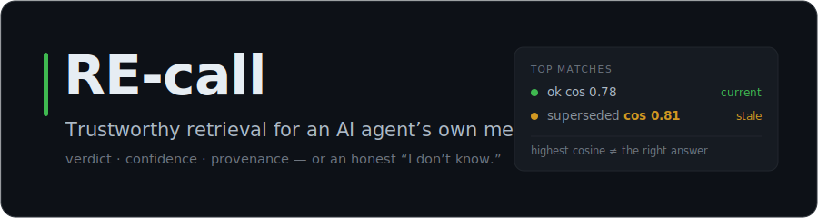
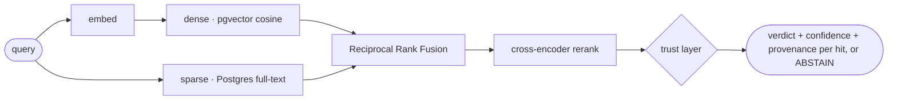
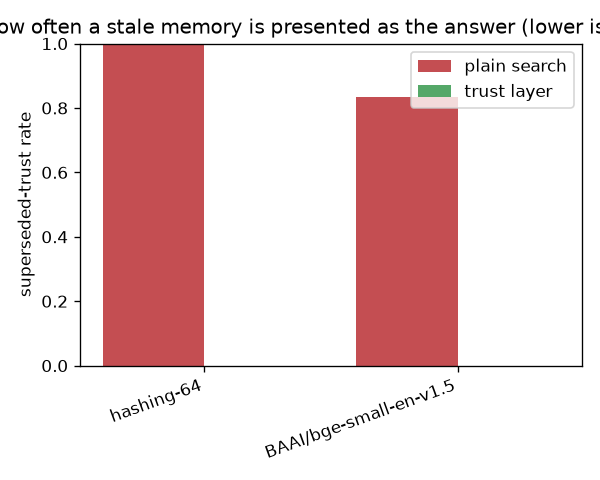
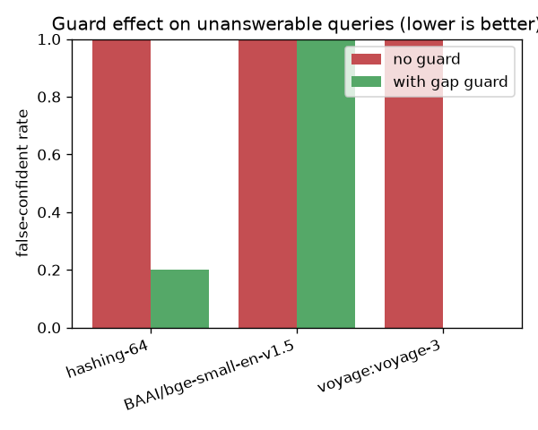

<p align="center">
  
</p>

<p align="center">
  <b>Trustworthy retrieval for an AI agent's own memory.</b><br>
  Every hit comes back with confidence, provenance, and validity — or the honest answer is <i>"I don't know."</i>
</p>

<p align="center">
  <a href="https://github.com/GiulioDER/RE-call/actions/workflows/ci.yml"></a>
  <a href="LICENSE"></a>
  
  
  
</p>

<p align="center">
  <a href="#see-it-in-one-screen">See it</a>
  &nbsp;·&nbsp;
  <a href="#quickstart--2-minutes-no-api-key">Quickstart</a>
  &nbsp;·&nbsp;
  <a href="#the-proof">Proof</a>
  &nbsp;·&nbsp;
  <a href="docs/CASE_STUDY.md">Case study</a>
  &nbsp;·&nbsp;
  <a href="docs/USING_WITH_CLAUDE.md">Use with Claude</a>
  &nbsp;·&nbsp;
  <a href="docs/WRITEUP.md">Writeup</a>
</p>

---

**Most RAG hands back the closest vector match. That's the wrong answer more often than you'd think.**

A long-running agent piles up memory — decisions, closed experiments, incident notes — and then it
**re-litigates settled decisions**, **hallucinates over gaps** the memory can't fill, and **builds on
facts that are no longer true**. The catch: when you've reversed a decision, the *stale* memory of it
is often the **highest-cosine hit in the whole result**. Similarity search serves it, confidently.

RE-call is a retrieval engine for that memory that is *honest about what it doesn't know*. It returns
**verdict + confidence + provenance** with every hit — not just similarity — demotes memories that
were superseded or expired, and prefers an explicit **abstention** over confident noise.

## See it in one screen

<p align="center">
  
</p>

<details>
<summary>same run, as text</summary>

```text
$ python -m recall.cli demo

[ok] query='how many requests per second can a client make?'
  ok           conf=1.00  cos=0.784  rate_limits_v2.md                       '# API rate limits (revised)'
  superseded   conf=1.00  cos=0.806  rate_limits_v1.md → use rate_limits_v2  '# API rate limits … limited to 100'

[ABSTAIN · gap] query='how do we handle penguins on mars?'
  reason: no hit above the calibrated confidence threshold (probable corpus gap)
```
</details>

Look at the cosines. The **stale** rate-limit memory scores **higher (0.806)** than the current one —
plain vector search would return it, and the agent would build on a limit that no longer exists.
RE-call flags it `superseded`, points at its successor, and puts the *current* memory on top. And when
the memory genuinely has no answer, it says so — an explicit `ABSTAIN`, not the least-irrelevant chunk
dressed up as an answer. **That ordering decision is the whole thesis.**

## The proof

This isn't a claim, it's a measured, reproducible result. On validity-sensitive queries (worded
deliberately *closer to the stale memory*):

> Plain similarity search returns the superseded/expired memory as the answer **83–100% of the time.**
> With RE-call's trust layer that rate is **0.00 — on every embedder — with identical ranking quality.**

An ablation harness scores every `embedder × fusion` config on a labelled query set (precision@k,
recall@k, MRR, nDCG, and a guard-specific **false-confident rate**), and the findings include what
*didn't* work — see [The findings](#the-findings) below.

## What makes it different

- **Trust verdicts, not just scores** — every hit carries a verdict (`ok · superseded · expired · not_yet_valid · low_confidence`), a **calibrated confidence**, and provenance (source, chunk, `indexed_at`). A superseded or out-of-window memory loses to its successor — or to *"I don't know"* — even with the top cosine.
- **It knows when it doesn't know** — when the best match is weak, RE-call returns a `gap_warning` instead of hallucinating; the abstention threshold is calibrated *per embedder* against a labelled set (`recall calibrate`), because that threshold **provably doesn't transfer** between models (see the findings).
- **Catches the near-miss** *(opt-in)* — a QNLI entailment judge rejects a high-similarity memory that doesn't actually *answer* the query (which clears any cosine threshold by construction). A decision, not another score — nothing to recalibrate per embedder. OFF by default; cost measured.
- **Write-time graph checks** — `recall lint` catches broken supersession edges (dangling / cyclic `supersedes:`, versioned siblings with no link, closures declared only in prose). No DB, exit 1 on errors, CI-ready. `--semantic` adds a retrieval-based **missing-edge** check — the write-time mirror of anti-re-litigation.
- **Freshness-aware** — every result reports how stale the index is, so a rotting memory warns instead of silently serving old facts.
- **Production-shaped** — PostgreSQL + pgvector, hybrid dense + full-text retrieval fused with **RRF**, cross-encoder reranking, and an **MCP server** for Claude. Integration-tested against a real database — no mock DB.

## How it works



Dense semantic search and sparse keyword search each retrieve candidates; **Reciprocal Rank Fusion**
merges them, a cross-encoder reranks, and the **trust layer** judges every hit — supersession,
validity window, calibrated confidence — before it ever reaches the agent. Validity is plain
frontmatter in the memory itself (`supersedes: old_doc.md`, `valid_until: 2026-06-30`) — *authored,
not inferred*.

## The findings

Six honest results from the ablation harness — the wins **and** the things that didn't pan out:

<p align="center">
  
  &nbsp;
  
</p>

- **Similarity cannot see supersession — the trust layer can.** Plain search returns the stale memory **83–100%** of the time; the trust layer drives that to **0.00 on every embedder** with identical MRR. → [FINDINGS §4](results/FINDINGS.md)
- **The gap threshold doesn't transfer across embedders.** The default `0.50` sits below FastEmbed's entire cosine distribution — false-confident rate **1.00** (the guard never fires). Calibrate per embedder to `~0.70` → **0.00**. Don't hard-code it.
- **Reranking rescues a weak embedder.** Hybrid + cross-encoder lifts MRR **0.63 → 1.00** on the offline embedder — real, but situational: a strong embedder already saturates this corpus.
- **Fine-tuning pays off only for a vocabulary gap.** On a rich corpus the base saturates (Δ **+0.00**); on opaque jargon it can't decode, fine-tuning lifts held-out MRR **0.31 → 0.55 (+79%)**. Measure the gap first. → [study](docs/RAG_TRAINING_STUDY.md)
- **Near-misses need a judge — and the judge needs the threshold.** The calibrated threshold is blind to high-similarity-but-wrong hits (FCR **0.40–1.00**); a QNLI entailment stage cuts it (**1.00→0.60, 0.80→0.50**) with the *identical judge on every embedder, zero recalibration* — but judge-alone *degrades* far-gap detection. Different failure classes: **stack them.** → [study](docs/ENTAILMENT_SUPERSESSION_STUDY.md)
- **Timestamps can't replace declared supersession — even steelmanned.** "Trust the newest relevant hit" still trusts the stale memory **83–100%** of the time (worse than plain ranking on bge-small). Supersession is a *relation between two documents*; a per-document timestamp can't see it.

> Full methodology + per-embedder tables → **[results/FINDINGS.md](results/FINDINGS.md)**.
> **164 tests**, the DB-touching ones against a real pgvector container (no mock DB), verified in CI.

## Where this comes from

RE-call isn't a toy. It's extracted from the memory system behind a **production trading-research
agent** whose memory outgrew its context window — **≈660 typed markdown memos (~5 MB), re-indexed
daily.** Every guard here is a scar from a real failure: re-litigating a falsified experiment, trusting
a weak hit on an unanswerable question, serving a stale fact.

**→ [Read the redacted case study](docs/CASE_STUDY.md)** — the real structure, the guards in action, and exactly what's public vs private.

## Quickstart · 2 minutes, no API key

```bash
git clone https://github.com/GiulioDER/RE-call && cd RE-call
docker compose up -d --wait                     # Postgres + pgvector (waits until healthy)
python -m venv .venv && . .venv/bin/activate    # Windows: .\.venv\Scripts\activate
pip install -e ".[fastembed,dev]"
python -m recall.cli demo
```

Default embedder is local **FastEmbed** (no key); `--embedder hashing` is a fully-offline fallback.

## Use it

```bash
python -m recall.cli index ./path/to/markdown            # index your own docs
python -m recall.cli search "your question"              # → verdicts + confidence + gap/freshness flags
python -m recall.cli search "..." --entail               # + QNLI near-miss judge (recall[entail], opt-in)
python -m recall.cli calibrate recall/eval/queries.json  # per-embedder abstention threshold → calibration.json
python -m recall.cli lint ./path/to/markdown             # supersession-graph completeness (no DB)
python -m recall.cli lint ./docs --semantic              # + retrieval-based missing-edge check (DB, opt-in)
```

Point `RECALL_DSN` at any Postgres. Declare validity in the memory itself — plain frontmatter, no
schema changes (validity is *authored, not verified*: index only content you trust, because a
`supersedes:` claim is honored as written):

```markdown
---
supersedes: rate_limits_v1.md
valid_until: 2026-12-31
---
# API rate limits (revised)
...
```

**Code, not just prose.** For Python source, the engine chunks on `def` / `class` boundaries
instead of blindly splitting text, so natural-language questions land the exact function. Other
languages currently fall back to generic text chunking (multi-language, tree-sitter-based code
chunking is on the roadmap):

```text
$ python -m recall.cli index ./src --glob "**/*.py"   # your codebase
$ python -m recall.cli code                            # demo: search RE-call's OWN source

[ok] query='where is reciprocal rank fusion implemented?'
  ok           conf=1.00  cos=0.805  retriever.py  'def _rrf(rankings: list[list[str]], k: int = 60) -> '
[ok] query='how are embeddings stored in postgres?'
  ok           conf=1.00  cos=0.788  store.py      'class PgVectorStore:  """The single, production-g'
```

## Use it with Claude (MCP)

Expose memory to **Claude Code** or **Claude Desktop** as three tools — `recall_search`,
`recall_index`, `recall_stats` — so the agent queries its memory *before* it acts:

```bash
pip install -e ".[fastembed,mcp]"
python -m recall_mcp.server        # stdio server
```

The self-recall pattern: Claude calls `recall_search` **before** proposing an idea; if a closed
decision surfaces (and it isn't a `gap_warning`), it backs off instead of re-litigating. Every hit
carries `verdict` / `confidence` / `superseded_by` / `indexed_at`, and when `abstained` is true the
advice says so explicitly: *say you don't know — do not answer from these hits.*

**→ [Full guide: Claude Code + Desktop config, the three tools, and a real redacted loop](docs/USING_WITH_CLAUDE.md)**
&nbsp;·&nbsp; example agent: [`examples/self_recall_agent.py`](examples/self_recall_agent.py)

## Upgrading to 0.4.0

- **Chunking changed.** Oversized blocks are now force-split on whitespace (previously a
  fixed-stride window that could cut through words). Existing rows keep their old chunking until
  re-indexed, so run `python -m recall.cli index <root>` over the whole corpus.
- **`source` is stored resolved**, so re-indexing the same corpus by a different path spelling
  replaces its rows instead of duplicating them. The migration is not automatic: rows written
  before 0.4.0 under a *relative* path carry a different `source`, and `replace_sources` deletes
  by exact match, so a re-index leaves the old ones orphaned. Clear them explicitly:

  ```sql
  DELETE FROM chunks WHERE source NOT LIKE '/%' AND source !~ '^[A-Za-z]:';
  ```

- **An unresolvable supersession edge now fails closed.** When two documents share the basename a
  `supersedes:` edge names, the edge was already (correctly) not guessed — but the memories were
  still served as `ok`. They now come back `ambiguous_supersession` and the search abstains.
  `recall lint` reports the condition as an **error**, so fix the corpus before it surfaces as an
  abstention.

## Reproduce the evaluation

```bash
pip install -e ".[fastembed,rerank,entail,eval]"
make eval        # → results/RESULTS.md + the charts above
```

The Voyage cloud row appears when `VOYAGE_API_KEY` is set (shell env, or a gitignored `.env`).

## Tests

```bash
docker compose up -d --wait
pytest -v      # integration tests hit the real pgvector container — no mock DB
```

## License

[MIT](LICENSE).
