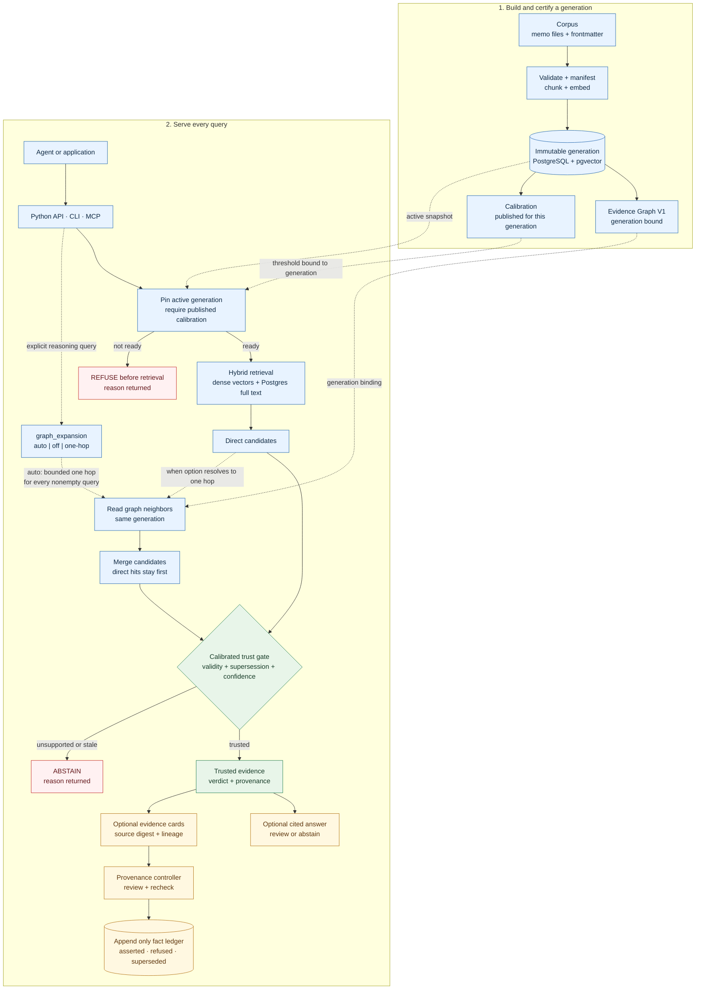

<p align="center">
  
</p>

<!-- mcp-name: io.github.GiulioDER/re-call -->

<p align="center">
  <b>Memory that abstains instead of guessing.</b><br>
  RE-call is agent memory on your own PostgreSQL with pgvector. Each result carries a verdict,
  confidence, and provenance, while unsupported questions are refused instead of answered by the
  nearest match.
</p>

<p align="center">
  <a href="https://github.com/GiulioDER/RE-call/actions/workflows/ci.yml"></a>
  <a href="https://pypi.org/project/recall-rag/"></a>
  <a href="https://github.com/GiulioDER/RE-call/blob/master/LICENSE"></a>
  
  
</p>

<p align="center">
  <a href="#what-is-re-call">What it is</a>
  &nbsp;·&nbsp;
  <a href="docs/FOR_AGENTS.md">For agents</a>
  &nbsp;·&nbsp;
  <a href="#how-it-works">How it works</a>
  &nbsp;·&nbsp;
  <a href="#quickstart">Try the demo</a>
  &nbsp;·&nbsp;
  <a href="#install-and-integrate">Install and integrate</a>
</p>

## What is RE-call

RE-call is agent memory on your own PostgreSQL database. It indexes source documents with pgvector
and keeps validity, lineage, confidence, and provenance attached to every result.

Vector search returns nearby text. RE-call also checks whether that text is current, supported, and
trustworthy enough for the query. A superseded claim is marked `superseded`; a result that does not
clear the calibrated trust gate becomes `ABSTAIN` with a reason. Declared supersession makes the current memory win
over stale but similar memory.

The default path uses local embeddings plus hybrid dense and Postgres full text retrieval. It needs
no memory-layer LLM call. Additional retrieval, reasoning, and structured-fact modules are
optional.

For the agent reading this, [RE-call for agents](docs/FOR_AGENTS.md) explains the experience loop
and how to use persistent memory as a trustworthy past rather than an unverified scratchpad.

## How it works

RE-call builds an immutable, calibrated generation once and serves queries against that pinned
generation. The solid path is the default. Dashed arrows mark the optional reasoning graph path or
generation bindings. Nothing bypasses the generation or trust boundary.


```mermaid
flowchart TB
    subgraph BUILD["1. Build and certify a generation"]
        direction LR
        SOURCE["Corpus<br/>memo files + frontmatter"] --> PREP["Validate + manifest<br/>chunk + embed"]
        PREP --> GEN[("Immutable generation<br/>PostgreSQL + pgvector")]
        GEN --> GRAPH["Evidence Graph V1<br/>generation bound"]
        GEN --> CAL["Calibration<br/>published for this generation"]
    end

    subgraph READ["2. Serve every query"]
        direction LR
        CLIENT["Agent or application"] --> ACCESS["Python API · CLI · MCP"]
        ACCESS --> PRECHECK["Pin active generation<br/>require published calibration"]
        PRECHECK -->|"ready"| RETRIEVE["Hybrid retrieval<br/>dense vectors + Postgres full text"]
        PRECHECK -->|"not ready"| REFUSE["REFUSE before retrieval<br/>reason returned"]
        RETRIEVE --> DIRECT["Direct candidates"]
        DIRECT --> GATE{"Calibrated trust gate<br/>validity + supersession + confidence"}
        ACCESS -. "explicit reasoning query" .-> OPTION["graph_expansion<br/>auto | off | one-hop"]
        OPTION -. "auto: bounded one hop<br/>for every nonempty query" .-> EXPAND["Read graph neighbors<br/>same generation"]
        DIRECT -. "when option resolves to one hop" .-> EXPAND
        GRAPH -. "generation binding" .-> EXPAND
        EXPAND --> MERGE["Merge candidates<br/>direct hits stay first"]
        MERGE --> GATE
        GATE -->|"trusted"| TRUSTED["Trusted evidence<br/>verdict + provenance"]
        GATE -->|"unsupported or stale"| ABSTAIN["ABSTAIN<br/>reason returned"]
        TRUSTED --> ANSWER["Optional cited answer<br/>review or abstain"]
        TRUSTED --> CARDS["Optional evidence cards<br/>source digest + lineage"]
        CARDS --> CONTROLLER["Provenance controller<br/>review + recheck"]
        CONTROLLER --> LEDGER[("Append only fact ledger<br/>asserted · refused · superseded")]
    end

    GEN -. "active snapshot" .-> PRECHECK
    CAL -. "threshold bound to generation" .-> PRECHECK

    classDef core fill:#e8f3ff,stroke:#2b6cb0,color:#102a43,stroke-width:1px;
    classDef trust fill:#e8f5e9,stroke:#2f855a,color:#163b27,stroke-width:1px;
    classDef optional fill:#fff8e1,stroke:#b7791f,color:#5f370e,stroke-width:1px;
    classDef stop fill:#fff1f2,stroke:#c53030,color:#63171b,stroke-width:1px;
    class SOURCE,PREP,GEN,GRAPH,CAL,CLIENT,ACCESS,PRECHECK,RETRIEVE,DIRECT,OPTION,EXPAND,MERGE core;
    class GATE,TRUSTED trust;
    class ANSWER,CARDS,CONTROLLER,LEDGER optional;
    class REFUSE,ABSTAIN stop;
```

Ordinary `recall search` follows the direct path. Explicit reasoning accepts `graph_expansion`:
`auto` is the default and resolves to bounded one hop expansion for every nonempty query; `off`
keeps direct retrieval only; `one-hop` forces the graph path. The CLI uses
`--graph-expansion auto|off|one-hop`; the MCP tool uses `graph_expansion="auto"|"off"|"one_hop"`.
Graph neighbors are generation bound, direct candidates remain first, and expanded candidates must
clear the same trust boundary before they can support a cited answer.

The opt in choices attach to different points in the system:

| Optional capability | Where it fits | What it adds |
|---|---|---|
| Hosted embedder | Build and query | Remote model calls for embeddings. Query and corpus text may leave the environment. |
| Learned sparse retrieval, SPLADE | Hybrid retrieval | A learned term weighted retrieval leg in addition to dense vectors and Postgres full text. |
| Reranker | After candidate fusion | Reorders the fused candidates with a cross encoder. |
| Entailment judge | After the trust decision | Demotes high similarity near misses that do not answer the question. |
| Evidence Graph version one | Explicit reasoning retrieval | Adds bounded, generation-bound structural neighbors to reasoning retrieval. See `graph_expansion` above for controls; graph candidates pass through trust before a cited answer can use them. |
| Structured fact application | Evidence cards | Lets a reviewed fact pass through the provenance controller into the append only ledger. |

For details, see the [architecture writeup](docs/WRITEUP.md), [provenance controller](docs/PROVENANCE_CONTROLLER.md), and [API reference](docs/API.md).

## Quickstart

Prerequisites: Python 3.11 or newer, Docker, and a Docker installation able to run PostgreSQL with
pgvector.

```bash
pip install "recall-rag[fastembed]"
recall quickstart
```

The demo starts a throwaway database, indexes a small corpus included in the package, and runs
three searches. It includes a normal answer, a stale claim that is returned as superseded, and a
question that is refused. The demo uses development trust and changes no personal files.

Remove the demo database when finished:

```bash
recall quickstart --remove
```

Already have PostgreSQL with pgvector? Use `recall quickstart --existing-dsn <dsn>` instead. The
demo is intentionally separate from a real install and is not calibrated for your data.

## Install and integrate

For your own corpus, provide PostgreSQL with pgvector and run the guided setup wizard after
installing `recall-rag[fastembed]`:

```bash
recall setup
```

It applies the schema, asks for the embedder and retrieval options, indexes the corpus, offers
calibration, and registers the selected agent integration. When the wizard asks whether to calibrate,
use a labeled query file that refers to the corpus you are installing. Calibration fitted
to the bundled demo is only an example, not a certification for your data. The schema uses an
ordered SQL migration path and pre-tenancy tables are migrated in place.

For Docker, an existing database, headless provisioning, manual calibration, and troubleshooting,
see [docs/INSTALLATION.md](docs/INSTALLATION.md) and [docs/WIZARD.md](docs/WIZARD.md).

### Choose an integration

| Use case | Install | Next step |
|---|---|---|
| CLI and Python | `pip install "recall-rag[fastembed]"` | Run `recall setup`, then use `recall search` or the [Python API](docs/API.md). |
| MCP, Claude Code, Claude Desktop, or Codex | `pip install "recall-rag[fastembed,mcp]"` | Run setup and follow [the MCP guide](docs/USING_WITH_CLAUDE.md). Host specific steps are below. |
| Claude Agent SDK | `pip install "recall-rag[agent,fastembed]"` | Use the in process integration in [USING_WITH_AGENT_SDK.md](docs/USING_WITH_AGENT_SDK.md). |
| LangChain or LlamaIndex | Install the matching extra | Use the adapters described in [API.md](docs/API.md). |
| Windows desktop installer | `pip install "recall-rag[desktop]"` | Run `recall-install`; see [the wizard guide](docs/WIZARD.md). |

#### Claude Code

Inside Claude Code, install the plugin after installing the Python package:

```text
/plugin marketplace add GiulioDER/RE-call
/plugin install recall@re-call
```

The plugin supplies the MCP server, memory search skill, and lifecycle hooks. `recall setup` still
needs to run against the project and database that Claude should use. The plugin keeps credentials
out of the repository. Details and manual wiring are in [plugin/README.md](plugin/README.md).

#### Codex

Run `recall setup` from the project. When Codex is detected, setup installs the Codex MCP server,
plugin bundle, memory skills, and hooks into the user configuration. Restart Codex afterward. The
Codex and Claude Code integrations share the same memo format and trust layer. See
[docs/CODEX_RECALL_INTEGRATION.md](docs/CODEX_RECALL_INTEGRATION.md).

#### Claude Agent SDK

The SDK integration runs the same tools in process and does not start an MCP server:

```python
from recall_agent import RecallAgentMemory

with RecallAgentMemory.from_env() as memory:
    options = memory.options()
```

See [docs/USING_WITH_AGENT_SDK.md](docs/USING_WITH_AGENT_SDK.md) for the complete example and
write-tool boundaries.

#### LangChain and LlamaIndex

Both adapters use the same trusted retrieval path. If trust abstains, they return no document by
default, and returned documents retain verdict, confidence, cosine, and supersession metadata.
See [docs/API.md](docs/API.md) for the supported classes and methods.

### If an install is not working

```bash
recall doctor
```

The doctor checks the interpreter, console scripts, embedder, Docker, database, pgvector, schema,
configured table and tenant, calibration, and agent registration. It changes nothing and prints the
repair command for each problem.

## Product surface

| Area | What ships |
|---|---|
| Retrieval and memory | Dense vectors plus Postgres full text with hybrid RRF, validity, calibrated confidence, provenance, trust verdicts, immutable generations, incremental indexing, pruning, and source erasure. |
| Structured facts | Citable evidence cards, provenance controller, append only fact ledger, current fact projection, and optional materialization outbox. |
| Quality | Real pgvector integration tests, type checking, linting, dependency audit, and a claim gate that checks published evidence in CI. |

RE-call is not a hosted memory service, dashboard, or automatic truth extractor. It does not rewrite
corpus metadata from an agent's inference. Reasoning is opt in, citation constrained, and review
aware. See [docs/PRODUCTION.md](docs/PRODUCTION.md) for deployment boundaries.

## Read next

| Need | Document |
|---|---|
| Why an agent needs persistent, trusted memory | [docs/FOR_AGENTS.md](docs/FOR_AGENTS.md) |
| Full documentation map | [docs/README.md](docs/README.md) |
| Install and provision | [docs/INSTALLATION.md](docs/INSTALLATION.md), [docs/WIZARD.md](docs/WIZARD.md) |
| Python, CLI, and MCP reference | [docs/API.md](docs/API.md) |
| Trust, architecture, and provenance | [docs/WRITEUP.md](docs/WRITEUP.md), [docs/PROVENANCE_CONTROLLER.md](docs/PROVENANCE_CONTROLLER.md) |
| Security and operations | [docs/AUTH.md](docs/AUTH.md), [docs/PRODUCTION.md](docs/PRODUCTION.md), [docs/OPERATING_MODES.md](docs/OPERATING_MODES.md) |
| Measurements and limits | [docs/EVIDENCE.md](docs/EVIDENCE.md), [results/FINDINGS.md](results/FINDINGS.md) |

Published numbers are tied to committed artifacts, and the claim gate checks them in CI. Benchmark
interpretation and limits belong in [docs/EVIDENCE.md](docs/EVIDENCE.md), not in this overview.

## Citation

If you describe RE-call in a paper, post, talk, or README of your own, cite the project and credit
Giulio D'Erme. Use [CITATION.cff](CITATION.cff) as the canonical citation source.

## License

RE-call is source available under the [PolyForm Noncommercial License 1.0.0](LICENSE). Personal,
educational, and noncommercial research use is permitted. Commercial use requires a separate
written license from the copyright holder. See [COMMERCIAL_LICENSE.md](COMMERCIAL_LICENSE.md) for
the boundary between permitted use and commercial licensing, and preserve [NOTICE](NOTICE) when
redistributing the software.
