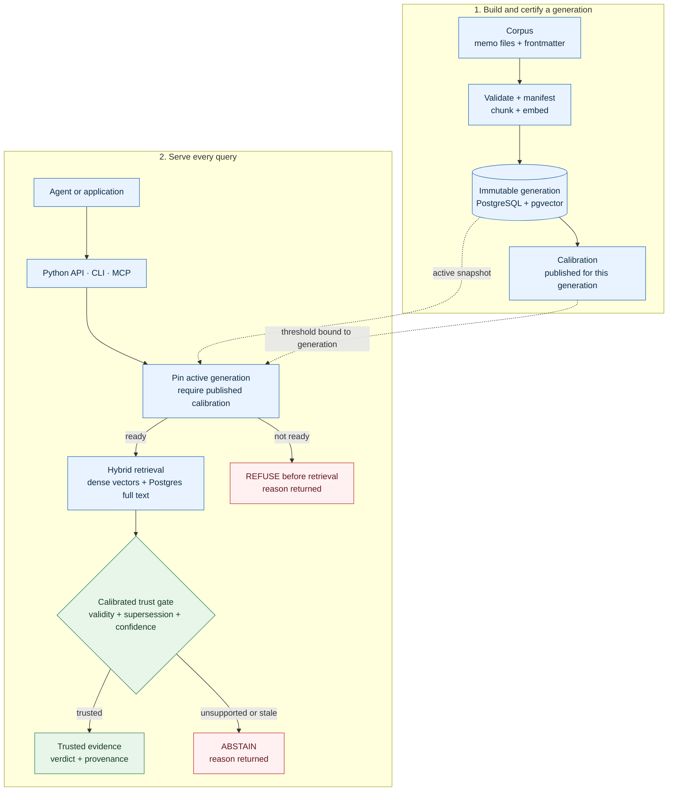
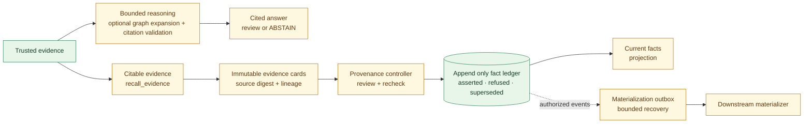

<p align="center">
  
</p>

<!-- mcp-name: io.github.GiulioDER/re-call -->

<p align="center">
  <b>Memory that abstains instead of guessing.</b><br>
  RE-call is agent memory on your own PostgreSQL with pgvector. Each result carries a verdict,
  confidence, and provenance, while unsupported questions are refused instead of answered by the
  nearest match.
</p>

<p align="center">
  <a href="https://github.com/GiulioDER/RE-call/actions/workflows/ci.yml"></a>
  <a href="https://pypi.org/project/recall-rag/"></a>
  <a href="https://github.com/GiulioDER/RE-call/blob/master/LICENSE"></a>
  
  
</p>

<p align="center">
  <a href="#what-is-re-call">What it is</a>
  &nbsp;·&nbsp;
  <a href="#how-it-works">How it works</a>
  &nbsp;·&nbsp;
  <a href="#quickstart">Try the demo</a>
  &nbsp;·&nbsp;
  <a href="#install-and-integrate">Install and integrate</a>
</p>

## What is RE-call

RE-call is a retrieval and memory layer for agents that need to know when a result is safe to use.
It stores source documents in your PostgreSQL database, indexes them with pgvector, and keeps
validity and lineage attached to every hit.

Plain vector search returns nearby text. RE-call also asks whether that text is current, supported,
and trustworthy enough for the query. A superseded claim comes back marked `superseded`; a result
that does not clear the calibrated trust gate becomes `ABSTAIN` with a reason. Declared supersession makes the current memory win over stale but similar memory.

The core path does not require a memory-layer LLM call. Local embeddings and hybrid retrieval are
available by default. Hosted embeddings, learned sparse retrieval, reranking, entailment judging,
reasoning, and structured fact application are opt in.

## How it works

Read the diagrams from top to bottom. The solid spine is the default path. Dashed arrows show a
binding or conditional relationship. Optional consumer modules branch from trusted evidence, while
retrieval upgrades attach at the stages named in the table. Nothing bypasses the generation or trust
boundary.


```mermaid
flowchart TB
    subgraph BUILD["1. Build and certify a generation"]
        direction LR
        SOURCE["Corpus<br/>memo files + frontmatter"] --> PREP["Validate + manifest<br/>chunk + embed"]
        PREP --> GEN[("Immutable generation<br/>PostgreSQL + pgvector")]
        GEN --> CAL["Calibration<br/>published for this generation"]
    end

    subgraph READ["2. Serve every query"]
        direction LR
        CLIENT["Agent or application"] --> ACCESS["Python API · CLI · MCP"]
        ACCESS --> PRECHECK["Pin active generation<br/>require published calibration"]
        PRECHECK -->|"ready"| RETRIEVE["Hybrid retrieval<br/>dense vectors + Postgres full text"]
        PRECHECK -->|"not ready"| REFUSE["REFUSE before retrieval<br/>reason returned"]
        RETRIEVE --> GATE{"Calibrated trust gate<br/>validity + supersession + confidence"}
        GATE -->|"trusted"| TRUSTED["Trusted evidence<br/>verdict + provenance"]
        GATE -->|"unsupported or stale"| ABSTAIN["ABSTAIN<br/>reason returned"]
    end

    GEN -. "active snapshot" .-> PRECHECK
    CAL -. "threshold bound to generation" .-> PRECHECK

    classDef core fill:#e8f3ff,stroke:#2b6cb0,color:#102a43,stroke-width:1px;
    classDef trust fill:#e8f5e9,stroke:#2f855a,color:#163b27,stroke-width:1px;
    classDef stop fill:#fff1f2,stroke:#c53030,color:#63171b,stroke-width:1px;
    class SOURCE,PREP,GEN,CAL,CLIENT,ACCESS,PRECHECK,RETRIEVE core;
    class GATE,TRUSTED trust;
    class REFUSE,ABSTAIN stop;
```

The optional consumers form a separate branch from trusted evidence:


```mermaid
flowchart LR
    TRUSTED["Trusted evidence"] --> REASON["Bounded reasoning<br/>optional graph expansion + citation validation"]
    REASON --> ANSWER["Cited answer<br/>review or ABSTAIN"]
    TRUSTED --> BUNDLE["Citable evidence<br/>recall_evidence"]
    BUNDLE --> CARDS["Immutable evidence cards<br/>source digest + lineage"]
    CARDS --> CONTROLLER["Provenance controller<br/>review + recheck"]
    CONTROLLER --> LEDGER[("Append only fact ledger<br/>asserted · refused · superseded")]
    LEDGER --> CURRENT["Current facts<br/>projection"]
    LEDGER -. "authorized events" .-> OUTBOX["Materialization outbox<br/>bounded recovery"]
    OUTBOX --> MATERIALIZER["Downstream materializer"]

    classDef optional fill:#fff8e1,stroke:#b7791f,color:#5f370e,stroke-width:1px;
    classDef trust fill:#e8f5e9,stroke:#2f855a,color:#163b27,stroke-width:1px;
    class TRUSTED,LEDGER trust;
    class REASON,ANSWER,BUNDLE,CARDS,CONTROLLER,CURRENT,OUTBOX,MATERIALIZER optional;
```

The opt in choices attach to different points in the system:

| Optional module | Attaches to | What it adds |
|---|---|---|
| Hosted embedder | Build and query | Remote model calls for embeddings. Query and corpus text may leave the environment. |
| Learned sparse retrieval, SPLADE | Hybrid retrieval | A learned term weighted retrieval leg in addition to dense vectors and Postgres full text. |
| Reranker | After candidate fusion | Reorders the fused candidates with a cross encoder. |
| Entailment judge | After the trust decision | Demotes high similarity near misses that do not answer the question. |
| Evidence Graph V1 | Reasoning | Adds bounded, generation bound one hop expansion. Expanded evidence returns through trust and citation checks. |
| Structured fact application | Evidence cards | Lets a reviewed fact pass through the provenance controller into the append only ledger. |

In practical terms:

1. A manifest turns a corpus into an immutable, tenant scoped generation. Calibration is published
   for that generation before strict serving.
2. A query goes through an integration surface, pins the active generation, retrieves candidates,
   and passes through validity, supersession, confidence, and calibration checks.
3. The result is trusted evidence or an abstention with a reason. Optional consumers can reason over
   the evidence, create citable cards, or propose a reviewed structured fact. The provenance
   controller rechecks the evidence before the append only ledger accepts or refuses the fact.

The detailed architecture is in [docs/WRITEUP.md](docs/WRITEUP.md). The provenance boundary is
documented in [docs/PROVENANCE_CONTROLLER.md](docs/PROVENANCE_CONTROLLER.md), and the complete
API is in [docs/API.md](docs/API.md).

## Quickstart

Prerequisites: Python 3.11 or newer, Docker, and a Docker installation able to run PostgreSQL with
pgvector.

```bash
pip install "recall-rag[fastembed]"
recall quickstart
```

The demo starts a throwaway database, indexes a small corpus included in the package, and runs
three searches. It includes a normal answer, a stale claim that is returned as superseded, and a
question that is refused. The demo uses development trust and changes no personal files.

Remove the demo database when finished:

```bash
recall quickstart --remove
```

Already have PostgreSQL with pgvector? Use `recall quickstart --existing-dsn <dsn>` instead. The
demo is intentionally separate from a real install and is not calibrated for your data.

## Install and integrate

For your own corpus, install the package, provide PostgreSQL with pgvector, and run the guided setup wizard:

```bash
pip install "recall-rag[fastembed]"
recall setup
```

The wizard applies the schema, asks for the embedder and retrieval options, indexes the corpus,
offers calibration, and registers the selected agent integration. When the wizard asks whether to calibrate, use a labeled query file that refers to the corpus you are installing. Calibration fitted
to the bundled demo is only an example, not a certification for your data. The schema uses an
ordered SQL migration path and pre-tenancy tables are migrated in place.

For Docker, an existing database, headless provisioning, manual calibration, and troubleshooting,
see [docs/INSTALLATION.md](docs/INSTALLATION.md) and [docs/WIZARD.md](docs/WIZARD.md).

### Choose an integration

| Use case | Install | Next step |
|---|---|---|
| CLI and Python | `pip install "recall-rag[fastembed]"` | Run `recall setup`, then use `recall search` or the [Python API](docs/API.md). |
| MCP server | `pip install "recall-rag[fastembed,mcp]"` | Run `recall setup` or follow [the MCP guide](docs/USING_WITH_CLAUDE.md). |
| Claude Code | The MCP install plus the plugin | Install the package, then run the plugin commands below. `recall setup` configures the project corpus and hooks. |
| Claude Desktop | The MCP install | Run setup, add the server block from [the Claude guide](docs/USING_WITH_CLAUDE.md), then restart Claude Desktop. |
| Codex | `pip install "recall-rag[fastembed]"` | Run `recall setup` from the project. It detects Codex and installs the MCP server, plugin bundle, skills, and lifecycle hooks. |
| Claude Agent SDK | `pip install "recall-rag[agent,fastembed]"` | Use the in-process integration in [USING_WITH_AGENT_SDK.md](docs/USING_WITH_AGENT_SDK.md). |
| LangChain | `pip install "recall-rag[langchain,fastembed]"` | Use `recall.integrations.langchain.RecallRetriever`. |
| LlamaIndex | `pip install "recall-rag[llamaindex,fastembed]"` plus `llama-index-core` | Use `recall.integrations.llamaindex.RecallRetriever`. |
| Windows desktop installer | `pip install "recall-rag[desktop]"` | Run `recall-install`. See [the wizard guide](docs/WIZARD.md). |

#### Claude Code

Inside Claude Code, install the plugin after installing the Python package:

```text
/plugin marketplace add GiulioDER/RE-call
/plugin install recall@re-call
```

The plugin supplies the MCP server, memory search skill, and lifecycle hooks. `recall setup` still
needs to run against the project and database that Claude should use. The plugin keeps credentials
out of the repository. Details and manual wiring are in [plugin/README.md](plugin/README.md).

#### Codex

Run `recall setup` from the project. When Codex is detected, setup installs the Codex MCP server,
plugin bundle, memory skills, and hooks into the user configuration. Restart Codex afterward. The
Codex and Claude Code integrations share the same memo format and trust layer. See
[docs/CODEX_RECALL_INTEGRATION.md](docs/CODEX_RECALL_INTEGRATION.md).

#### Claude Agent SDK

The SDK integration runs the same tools in process and does not start an MCP server:

```python
from recall_agent import RecallAgentMemory

with RecallAgentMemory.from_env() as memory:
    options = memory.options()
```

See [docs/USING_WITH_AGENT_SDK.md](docs/USING_WITH_AGENT_SDK.md) for the complete example and
write-tool boundaries.

#### LangChain and LlamaIndex

Both adapters use the same trusted retrieval path. If trust abstains, they return no document by
default, and returned documents retain verdict, confidence, cosine, and supersession metadata.
See [docs/API.md](docs/API.md) for the supported classes and methods.

### If an install is not working

```bash
recall doctor
```

The doctor checks the interpreter, console scripts, embedder, Docker, database, pgvector, schema,
configured table and tenant, calibration, and agent registration. It changes nothing and prints the
repair command for each problem.

## Product surface

| Area | What ships |
|---|---|
| Retrieval | Dense vectors plus Postgres full text with hybrid RRF, optional learned sparse retrieval and reranking, validity, calibrated confidence, provenance, and trust verdicts. |
| Storage | PostgreSQL with pgvector, immutable generations, migrations, incremental indexing, pruning, and source erasure. |
| Agent access | CLI, MCP, Claude Code, Claude Desktop, Codex, Claude Agent SDK, LangChain, LlamaIndex, and Python APIs. |
| Structured facts | Citable evidence cards, provenance controller, append only fact ledger, current fact projection, and optional materialization outbox. |
| Quality | Real pgvector integration tests, type checking, linting, dependency audit, and a claim gate that checks published evidence in CI. |

RE-call is not a hosted memory service, a dashboard, or an automatic truth extractor. It does not
rewrite corpus metadata from an agent's inference. Reasoning is opt in, citation constrained, and
review aware. See [docs/PRODUCTION.md](docs/PRODUCTION.md) for deployment boundaries.

## Read next

| Need | Document |
|---|---|
| Full documentation map | [docs/README.md](docs/README.md) |
| Installation and provisioning | [docs/INSTALLATION.md](docs/INSTALLATION.md) |
| Python, CLI, and MCP reference | [docs/API.md](docs/API.md) |
| Trust, architecture, and provenance | [docs/WRITEUP.md](docs/WRITEUP.md), [docs/PROVENANCE_CONTROLLER.md](docs/PROVENANCE_CONTROLLER.md) |
| Calibration and generations | [docs/FIRST_CALIBRATION.md](docs/FIRST_CALIBRATION.md), [docs/CALIBRATION.md](docs/CALIBRATION.md), [docs/GENERATIONS.md](docs/GENERATIONS.md) |
| Security and operations | [docs/AUTH.md](docs/AUTH.md), [docs/MIGRATIONS.md](docs/MIGRATIONS.md), [docs/OPERATING_MODES.md](docs/OPERATING_MODES.md) |
| Measurements and limits | [docs/EVIDENCE.md](docs/EVIDENCE.md), [results/FINDINGS.md](results/FINDINGS.md) |
| Upgrade notes | [CHANGELOG.md](CHANGELOG.md) |

Published numbers are tied to committed artifacts, and the claim gate checks them in CI. Benchmark
interpretation and limits belong in [docs/EVIDENCE.md](docs/EVIDENCE.md), not in this overview.

## Citation

If you describe RE-call in a paper, post, talk, or README of your own, cite the project and credit
Giulio D'Erme. Use [CITATION.cff](CITATION.cff) as the canonical citation source.

## License

Apache 2.0 license. See [LICENSE](LICENSE), and keep [NOTICE](NOTICE) with redistributed derivative
works.
