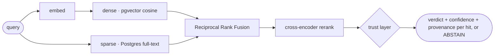

<p align="center">
  
</p>

<p align="center">
  <b>Trustworthy retrieval for an AI agent's own memory.</b><br>
  Every hit comes back with confidence, provenance, and validity — or the honest answer is <i>"I don't know."</i>
</p>

<p align="center">
  <a href="https://github.com/GiulioDER/RE-call/actions/workflows/ci.yml"></a>
  <a href="https://github.com/GiulioDER/RE-call/blob/master/LICENSE"></a>
  
  
  
</p>

<p align="center">
  <a href="#why-re-call">Why RE-call</a>
  &nbsp;·&nbsp;
  <a href="#who-is-it-for">Who it's for</a>
  &nbsp;·&nbsp;
  <a href="#see-it-in-one-screen">See it</a>
  &nbsp;·&nbsp;
  <a href="#what-is-actually-verified">What's verified</a>
  &nbsp;·&nbsp;
  <a href="#quickstart--2-minutes-no-api-key">Quickstart</a>
  &nbsp;·&nbsp;
  <a href="#what-this-does-not-do">Limits</a>
</p>

---

## Why RE-call

Give your AI agent, app, or team a long-term memory that is **free to run**, **stays on your
machines**, and **tells the truth about what it knows**.

- **$0 per memory, at any scale.** There is no LLM anywhere in the ingest or retrieval path —
  writing a memory is an embedding, searching is Postgres. In the head-to-head below, building the
  full benchmark's memory cost Mem0 **$7.29** in metered API calls; RE-call cost **$0.00** — and
  scored higher on the same questions.
- **Your data never leaves your infrastructure.** Local embeddings plus the PostgreSQL you already
  run and back up. No vendor cloud, no graph database, no per-query data egress — which also means
  it works offline and in privacy-bound environments. (A cloud embedder is a measured *option* for
  jargon-heavy corpora, never a dependency.)
- **Performance you can check.** Against **Mem0** — the most-adopted open-source memory layer — on
  the LOCOMO benchmark, with an identical generator and judge and paired questions, RE-call is the
  more accurate system on both OpenAI reader models the field benchmarks with (p = 0.0002–0.0065,
  Holm-corrected), and refuses fewer legitimate questions. We also publish the configuration where
  it loses, because a benchmark you can't lose isn't one.
- **It knows when it doesn't know.** Every result carries a verdict, a confidence, and where it
  came from. Memories that were superseded or expired are demoted instead of served, and a question
  your memory can't answer gets an explicit *"I don't know"* instead of confident noise.

## Who is it for

| you are | the problem you have | what RE-call does about it |
|---|---|---|
| **a dev building an agent** | it re-litigates settled decisions and contradicts its own memory | supersession and validity enforced at retrieval; abstention as a first-class return value; drop-in LangChain / LlamaIndex retrievers and an MCP server for Claude |
| **a solo founder / indie hacker** | memory layers charge an LLM call for every memory written | $0 marginal cost, forever — embed locally, store in the Postgres you already have, and scaling up never creates a new API bill |
| **a SaaS or small company** | user data can't be shipped to a third party just to have "memory" | multi-tenant with database-enforced row-level security, token auth, `recall forget` for right-to-erasure, MIT license, all on your own Postgres |
| **a trader / researcher / operator** | notes pile up and the stale conclusion outranks its own correction | built inside a production trading-research agent for exactly this: closed experiments stay closed, reversed decisions stop resurfacing |

**Try it in 2 minutes, no API key** → [Quickstart](#quickstart--2-minutes-no-api-key). Everything
below this point is the evidence: what was measured, how, and where it fails — with the losses
published next to the wins.

---

## The problem, precisely

**Most RAG hands back the closest vector match. That's the wrong answer more often than you'd think.**

A long-running agent piles up memory — decisions, closed experiments, incident notes — and then it
**re-litigates settled decisions**, **hallucinates over gaps** the memory can't fill, and **builds on
facts that are no longer true**. The catch: when you've reversed a decision, the *stale* memory of it
is often the **highest-cosine hit in the whole result**. Similarity search serves it, confidently.

RE-call is a retrieval engine for that memory that is *honest about what it doesn't know*. It returns
**verdict + confidence + provenance** with every hit — not just similarity — demotes memories that
were superseded or expired, and prefers an explicit **abstention** over confident noise.

## RE-call's edges, measured

Head-to-head against **[Mem0](https://github.com/mem0ai/mem0)** — the most-adopted open-source
memory layer — on the public **LOCOMO** benchmark, with an *identical* generator and judge and
paired questions (full table, losses and caveats included →
[FINDINGS §9d](https://github.com/GiulioDER/RE-call/blob/master/results/FINDINGS.md)):

- 🎯 **More accurate** on both OpenAI reader models the field benchmarks with (paired p = 0.0002–0.0065, Holm-corrected) — and the lead holds even on **Mem0's own default embedder** (`text-embedding-3-small`): **0.42 vs 0.366** at full n=1,540.
- 💸 **$0 to build, at any scale** — no LLM anywhere in the ingest or retrieval path. Building the benchmark's memory cost Mem0 **$7.29** in metered API calls; RE-call **$0.00**.
- ⚡ **~4.3× faster to build** memory (and measurably faster to query) — a large corpus or a write-heavy agent fills fast, with no per-write API bill.
- 🔒 **On your own Postgres**, offline-capable — every hit returns a verdict, confidence, and provenance, or an explicit *"I don't know."*

## See it in one screen

<p align="center">
  
</p>

<details>
<summary>same run, as text</summary>

```text
$ python -m recall.cli demo

[ok] query='how many requests per second can a client make?'
  ok           conf=1.00  cos=0.784  rate_limits_v2.md                       '# API rate limits (revised)'
  superseded   conf=1.00  cos=0.806  rate_limits_v1.md → use rate_limits_v2  '# API rate limits … limited to 100'

[ABSTAIN · gap] query='how do we handle penguins on mars?'
  reason: no hit above the calibrated confidence threshold (probable corpus gap)
```
</details>

Look at the cosines. The **stale** memory scores **higher (0.806)** than the current one — plain vector
search returns it, and the agent builds on a limit that no longer exists. RE-call flags it
`superseded`, points at its successor, and puts the *current* memory on top. When the memory genuinely
has no answer, it says so. **That ordering decision is the whole thesis.**

## What is actually verified

Every headline number below was measured, and every one carries its limit. Where a claim could not be
supported, it was withdrawn rather than softened — the withdrawals are listed too, because a claims
table without them is marketing.

| Claim | Measurement | Limit |
|---|---|---|
| **Supersession beats similarity — where the edge was authored** | Superseded-trust rate **0.00**, 95% Wilson **[0.00, 0.02]**, n=250, against a baseline of **1.00** — plain search returns the stale memory *every time* on adversarially-worded queries | Generated corpus; the successor/abstain columns on it are **not** meaningful (below). **And the mechanism is only as good as its coverage: 2 of 792 real memos declared `supersedes:` while 60 closed a decision in prose** — the enforcement is exact, the corpus is sparse, and both halves are load-bearing ([below](#prior-art--and-where-this-genuinely-differs)) |
| **Abstention is calibrated, not guessed** | On the real corpus: threshold **0.728 ± 0.042** over 4 index rebuilds, false-abstain **0.015**, gap false-confidence **0.000** | Needs ≥ ~20 labelled samples; below that the rule loses its outlier robustness |
| **Timestamps cannot replace declared supersession** | "Trust the newest relevant hit", steelmanned, still trusts the stale memory **83–100%** of the time | — |
| **Reranking rescues a weak embedder** | Hybrid + cross-encoder lifts MRR **0.63 → 1.00** offline | Situational: a strong embedder already saturates this corpus |
| **Fine-tuning pays only for a vocabulary gap** | **+0.00** on a rich corpus; **0.31 → 0.55** held-out MRR on opaque jargon → [study](https://github.com/GiulioDER/RE-call/blob/master/docs/RAG_TRAINING_STUDY.md) | Measure your gap first |
| **Near-misses need a judge, not a threshold** | QNLI stage cuts near-miss false-confidence **0.70 → 0.30** (hashing) and **1.00 → 0.50** (bge-small), same judge across embedders, no per-embedder retuning → [RESULTS §3](https://github.com/GiulioDER/RE-call/blob/master/results/RESULTS.md) | Judge-alone *degrades* far-gap detection — the two stack, neither replaces the other. Costs ~0.1–1.0 s per query |
| **Retrieval, on a second public benchmark** | **knowledge-update 1.000** (36/36) — the category this library exists for, and the most robust one under haystack pressure (retains 74% of hit@5 across a 20× larger corpus where the overall figure retains 51%). Overall **hit@5 0.970** [0.94, 0.99] on LongMemEval's own per-question haystacks with the *free local* embedder → [FINDINGS §10](https://github.com/GiulioDER/RE-call/blob/master/results/FINDINGS.md) | A *retrieval* figure — evidence session in the top 5 — **not** the benchmark's LLM-judged answer accuracy. It does not belong in a column with one. **And 0.970 is the benchmark's ~49-session haystack, not a memory store: on one merged 19,195-session index the same questions score 0.366.** Both arms are published because the second is the one that looks like production |
| **Abstention has a bounded domain** | Far gaps: accuracy **1.00** (PEPs), **0.89** (real corpus). Near-misses: **it fails** — false-abstain **0.481** on LongMemEval, and **six** candidate signals all score AUC ≤ 0.753 — the best one's 95% interval tops out at **0.826**, below the ~0.90 a usable gate needs, so the bar is *excluded* rather than merely unproven. Independently corroborated on LOCOMO, where no judge configuration crosses into usable territory either → [FINDINGS §9–§10](https://github.com/GiulioDER/RE-call/blob/master/results/FINDINGS.md) | Nothing was retuned, because every alternative measured *worse*. `recall calibrate` reports separability **with its interval**, certifies on the interval's lower bound, and exits non-zero rather than certify a threshold the data cannot support |

Full methodology, per-embedder tables and the negative results → **[results/FINDINGS.md](https://github.com/GiulioDER/RE-call/blob/master/results/FINDINGS.md)**.
Design rationale and the reasoning behind each guard → **[docs/WRITEUP.md](https://github.com/GiulioDER/RE-call/blob/master/docs/WRITEUP.md)**.

### Claims that were withdrawn

A previous version of this file published each of these. They did not survive re-measurement:

- **"FCR @calibrated 0.00"** — the threshold was fitted and scored on the same samples. On separable
  data that is 0.00 by arithmetic. Now cross-validated, and the fitting rule was
  [replaced outright](https://github.com/GiulioDER/RE-call/blob/master/results/FINDINGS.md) after it proved to let **20.5%** of unanswerable queries through.
- **Coverage and abstention accuracy on generated corpora** — the "unanswerable" queries were an
  answerable query plus a nonsense suffix, so nothing could separate them. Rebuilt as genuinely
  off-topic questions; the *document*-level degeneracy remains and is stated as unmeasured.
- **"6× faster incremental re-index"** — understated. Measured on a Linux server it is **33×**.
- **Real-corpus recall@5 of 0.945** — that used document *headings* as queries, which is known-item
  retrieval. Against 110 hand-labelled questions phrased the way a person actually asks, hit@5 is
  **0.33** on that corpus. → [FINDINGS §7](https://github.com/GiulioDER/RE-call/blob/master/results/FINDINGS.md)
- **"Retrieval is the weakest part of this system"** — the sentence this file carried after that
  measurement. A replication on a public corpus scored **0.705** with the same local embedder, so
  0.33 was a property of *that corpus*, not of this software. Corrected rather than quietly
  deleted, because the claim was published. → [FINDINGS §8](https://github.com/GiulioDER/RE-call/blob/master/results/FINDINGS.md)
- **"ANN recall is tuned on the filtered path"** — the heading this file gave the HNSW fix, which
  reads as a recall improvement. Two measurements were taken and only the flattering one reached
  the docs: a fixture corpus moved 0.36–0.43 → 0.88–0.94, while an independent A/B on a
  normally-built corpus moved recall the *other* way (0.523 → 0.483). What was actually fixed is
  **truncation** — filtered search returning fewer results than requested. Reworded above, and
  corrected in FINDINGS §5b, rather than deleted.
  → [#57](https://github.com/GiulioDER/RE-call/pull/57)
- **"The collapse needs rows committed across several transactions"** — the mechanism this repo
  published for that pathology, attributing it to pgvector building a less well-connected graph.
  It is a **statistics race**: an unanalyzed table takes an exact `Seq Scan` plan, never consults
  the HNSW index, and reports recall 1.0000 under any `ef_search`. A single-transaction 20,000-row
  upsert reproduces the collapse just as hard once the table is analyzed. The batching was winning
  the race, not shaping the graph. → [#98](https://github.com/GiulioDER/RE-call/pull/98)
- **LOCOMO "hit@5 0.615"** — published as the pre-fix retrieval anchor, and as one of two runs whose
  spread was read as HNSW build noise. Its result artifact was never retained, so it cannot be
  checked against anything in this repo and has been **removed rather than restated**. The pre-fix
  anchor is now the run that *does* have an artifact: **0.624** at k=5, 0.798 at k=20.
  → [FINDINGS §9a](https://github.com/GiulioDER/RE-call/blob/master/results/FINDINGS.md)
- **"Per-question raw dumps are published"** — said of the Mem0 head-to-head. They are not:
  `benchmarks/results/` is gitignored, so each run writes them locally only. The harness, the
  pre-registration, the blind human labels, the corrupt-key list and an independent adversarial
  recompute of every cell *are* published, on the `bench/head-to-head` branch. Corrected in
  [RESULTS §9](https://github.com/GiulioDER/RE-call/blob/master/results/RESULTS.md) and FINDINGS §9d.

## Production posture

"Enterprise-grade" is not a single property, so here is the itemised version — verified on a real
host (PostgreSQL 17, pgvector 0.8.2, Python 3.12, connecting as an **unprivileged** role), not only
on a laptop.

| Property | Status | Evidence |
|---|---|---|
| **Multi-tenancy** | ✅ `tenant_id` on every row and every query, plus a row-level-security policy (`ENABLE` + `FORCE`) | Verified as a `NOSUPERUSER NOBYPASSRLS` role — a superuser bypasses RLS, so testing it as one would have passed vacuously |
| **Concurrency** | ✅ async MCP tools + `psycopg_pool`; the server previously served exactly **one** request at a time | FastMCP awaits async tools and calls sync ones *inline* — there is no thread offload |
| **Timeouts / resilience** | ✅ `statement_timeout`, `connect_timeout`, narrow reconnect-and-retry | The retry refuses to re-run a `QueryCanceled`, which would escape the very timeout that fired |
| **Security posture** | ✅ fail-closed on published default credentials; index-root confinement that survives symlinks on 3.11/3.12 | `pathlib` only gained `recurse_symlinks` in 3.13 |
| **Observability** | ✅ `logging` (text/JSON), counters and latency percentiles for abstention, verdicts, reconnects; surfaced through the MCP `recall_stats` tool | The library never attaches handlers — that is the host's job |
| **Incremental indexing** | ✅ content-hash skip, bounded-memory batched writes, prunes files deleted from disk | 5,100 chunks / 1,120 files: full **7.4 s**, unchanged re-index **0.22 s** |
| **Scale characteristics** | ✅ measured at **50,600 chunks**: recall@5 1.00 filtered and unfiltered, search p50/p95/p99 | Templated text; absolute retrieval quality is optimistic |
| **Real-corpus operation** | ✅ 794 hand-written memos → 6,491 chunks, p50 **78 ms** | Works at this size; see the retrieval row for how well |
| **Retrieval quality, real questions** | ✅ **hit@5 0.705** [0.56, 0.82] on a public 746-doc corpus with the free local embedder · ⚠️ **0.348** on an idiosyncratic private one — see [the tables below](#retrieval-quality-it-depends-on-your-corpus-and-here-is-the-rule) | Measured on 110 hand-labelled questions per corpus, not on headings. Corpus vocabulary dominates: a cloud embedder is worth +0.28 on the hard corpus and +0.02 on the ordinary one |
| **Data erasure** | ✅ `recall forget` / `recall_forget` permanently delete a source's chunks; previews by default, `--yes` to act | The right-to-erasure path — irreversible, so it refuses to act unattended without the flag |
| **Abuse bounds** | ✅ `recall_index` refuses before embedding anything if a request exceeds `RECALL_INDEX_MAX_FILES` / `RECALL_INDEX_MAX_BYTES` | A client-callable indexer with no cap is an unbounded spend on a cloud embedder |
| **Authentication** | ✅ bearer tokens on the HTTP transports, three scopes, one tenant per principal — see [docs/AUTH.md](https://github.com/GiulioDER/RE-call/blob/master/docs/AUTH.md) | Starting an HTTP transport without tokens **refuses to boot** rather than warning. stdio stays unauthenticated by design: it is a private pipe, not a listener |
| **Schema migrations** | ❌ runtime `CREATE TABLE IF NOT EXISTS`, no versioned upgrade path | Pre-tenancy tables *are* migrated in place, with a test |
| **HA / replication** | ❌ out of scope — this is a library over your Postgres | — |

## Retrieval quality: it depends on your corpus, and here is the rule

110 hand-labelled questions per corpus, phrased the way a person asks rather than as document
headings, on the **same** held-out split throughout. Two corpora, one embedder swap:

| hit@5 | bge-small (local, free) | voyage-3 (cloud) | Δ |
|---|---|---|---|
| private memory corpus — internal codenames, project shorthand | 0.348 [0.23, 0.49] | **0.630** [0.49, 0.76] | **+0.282** |
| **public Python PEPs** — ordinary technical prose | **0.705** [0.56, 0.82] | 0.727 [0.58, 0.84] | +0.022 *(n.s.)* |

> ### ⚠️ This rule was restated on 2026-07-27. Read this before the two rows above.
>
> The original rule read: *"pay for a cloud embedder only when your corpus vocabulary is unusual."*
> It was drawn from those two corpora, and **it does not hold**. On **17 held-out** BEIR /
> CQADupStack corpora — none of which produced the hypothesis — the cloud embedder wins **16 out of
> 17**, median **+0.059** hit@5 (dense-only **+0.105**), sign test **p = 0.00027**, 95 % CI
> **[+0.038, +0.068]**.
>
> **What predicts the gap is corpus SIZE, not unusual vocabulary**: median **+0.013** below 10 000
> documents against **+0.062** at 17 000+. The PEP corpus above is 746 documents — smaller than
> anything in that study — so its +0.022 is the small-corpus regime, not a property of "ordinary
> English". An out-of-vocabulary rate, the mechanism originally proposed, predicts **nothing**
> (Holm-adjusted p = 0.65).
>
> **The rule as it now stands:** a cloud embedder buys little on a few hundred documents and about
> **+0.06 hit@5** at twenty thousand — worth weighing against ~5× query latency, an API dependency
> and your documents leaving your infrastructure. And the cheapest way to predict your own case is
> not a corpus statistic: **measure your local embedder on ~30 labelled questions.**
>
> Full study, per-corpus table, confounds and limits →
> [`results/gap/FINDINGS-embedder-gap.md`](results/gap/FINDINGS-embedder-gap.md)

**On this corpus the pipeline was not the cap.** Three other levers were tested one at a time on the
same questions and none moved it: cross-encoder rerank +0.065 *(n.s., 57× latency)*, chunk size
400/800/1600 **+0.000**, candidate pool 20 → 100 *(n.s.)*. Abstention accuracy held at 0.89–1.00
throughout — the trust layer was never the bottleneck on either corpus.

> ### ⚠️ The rerank null did NOT generalise — corrected 2026-07-27
>
> That +0.065 came from **110 questions** and was not significant at that size. On **LOCOMO,
> n = 1 536**, reranking is the **largest single retrieval gain this project has measured**:
> **hit@5 0.671 → 0.777**, intervals disjoint from the baseline through k=10 — roughly **twice** the
> best embedder effect (§8's +0.059 median across 17 corpora). It lifts every question category,
> including the multi-hop floor (0.478 → 0.533).
>
> It stays **off by default** because it costs ~**1 050 ms/query** on CPU (≈4× wall clock), and it
> is one flag to turn on. Worth it when a human is waiting for the answer; leave it off for
> high-volume automated retrieval or constrained hardware. `ms-marco-MiniLM-L-6-v2` is the right
> model — `bge-reranker-base`, 12× larger and four years newer, is statistically
> **indistinguishable** at 6.3× the per-query cost.
>
> Numbers → [`RESULTS.md` §11](results/RESULTS.md) · meaning →
> [`FINDINGS.md` §11](results/FINDINGS.md)

> **One claim here was withdrawn.** The pool null was read as "bigger pools cannot help". It could
> not have detected a pool effect at all — `hnsw.ef_search` capped the dense leg at 40, and RRF
> fuses round-robin so a top-5 reads ~3 ranks into each leg whatever the pool is. Where the
> comparison has power (FinanceBench, n=150) a bigger pool **did** help: 0.393 → 0.527. The recall
> ceiling is real and the embedder is what moved it — but the pipeline was never actually ruled out.
> → [FINDINGS §7](https://github.com/GiulioDER/RE-call/blob/master/results/FINDINGS.md)

### Against a baseline — because 0.705 means nothing on its own

A hit@5 is only a result next to what a boring baseline scores on the *same* corpus, chunks and
questions. On the PEPs, bge-small, 44 held-out answerable questions:

| arm | hit@5 | MRR | p50 | reading |
|---|---|---|---|---|
| **BM25** (Okapi, untuned) | 0.455 [0.32, 0.60] | 0.313 | 150 ms | the thirty-year-old anchor |
| sparse only (Postgres FTS) | 0.023 [0.00, 0.12] | 0.023 | 24 ms | near-useless alone on this corpus |
| dense only (pgvector) | 0.682 [0.53, 0.80] | 0.483 | 31 ms | carries almost all of the result |
| **hybrid** (dense + sparse + RRF) | **0.705** [0.56, 0.82] | 0.494 | 26 ms | the published number |

**The pipeline beats BM25 by +0.25**, so the embedding stack earns its keep — and **dense is doing
the work**: hybrid's +0.023 over dense-alone is inside the interval. On ordinary prose the fusion
barely moves the top-5; its value is on the rare identifiers a memory corpus has and this one does
not. (BM25's tokeniser has no stemming while the FTS leg does, so it is mildly handicapped on
morphology — noted in `recall/eval/bm25.py`; it does not move the +0.25.)

Reproduce the public half end to end — corpus, questions and ground truth are all public:

```bash
git clone --depth 1 https://github.com/python/peps
python -m recall.eval.labelled --corpus peps/peps --questions recall/eval/peps_questions.json --glob '**/*.rst'
```

→ Every number, its command and its evidence tier: **[results/RESULTS.md](https://github.com/GiulioDER/RE-call/blob/master/results/RESULTS.md)**.
What each one means and where it stops: **[results/FINDINGS.md](https://github.com/GiulioDER/RE-call/blob/master/results/FINDINGS.md)**.


## How it works


```mermaid
flowchart LR
    Q([query]) --> E[embed]
    E --> D[dense · pgvector cosine]
    Q --> S[sparse · Postgres full-text]
    D --> F[Reciprocal Rank Fusion]
    S --> F
    F --> R[cross-encoder rerank]
    R --> G{trust layer}
    G --> O([verdict + confidence + provenance per hit, or ABSTAIN])
```

Dense semantic search and sparse keyword search each retrieve candidates; **Reciprocal Rank Fusion**
merges them, a cross-encoder reranks, and the **trust layer** judges every hit — supersession,
validity window, calibrated confidence — before it reaches the agent. Validity is plain frontmatter
in the memory itself (`supersedes: old_doc.md`, `valid_until: 2026-06-30`) — *authored, not inferred*,
because a claim honoured as written is safe and a claim guessed at is not.

## Prior art — and where this genuinely differs

Agent memory is a crowded field. Everything below is Apache-2.0 and further along than this
project; a claim to novelty has to survive them, so here is the comparison rather than an
implication that the corner is empty.

| | what it is | how it handles a fact that stopped being true | what it needs |
|---|---|---|---|
| **[Graphiti](https://github.com/getzep/graphiti)** (powers [Zep](https://github.com/getzep/zep)) | temporal knowledge-graph engine | bi-temporal validity windows; contradicted facts are **invalidated, not deleted** — **inferred by an LLM at ingestion** | a graph DB (Neo4j / FalkorDB / Neptune) + an LLM call per episode |
| **[Mem0](https://github.com/mem0ai/mem0)** | memory layer (lib · self-host · cloud) | as of its 2026 redesign, **ADD-only** — no update or delete; memories accumulate and temporal reasoning happens at *retrieval* | an LLM for extraction; hybrid semantic + BM25 + entity linking |
| **[Letta](https://github.com/letta-ai/letta)** (ex-MemGPT) | stateful-agent **runtime** | memory blocks + context management, at the agent layer | an agent runtime — a different layer entirely, not a retrieval library |
| **[LangMem](https://langchain-ai.github.io/langmem/)** | memory-management toolkit | not addressed in its docs | pairs with LangGraph, though not required |
| **RE-call** | retrieval library over Postgres | validity **declared by the author** in frontmatter (`supersedes:`, `valid_until:`), enforced as a post-processing layer | PostgreSQL + pgvector. No LLM in the retrieval path, no graph DB |

**The one real difference is who decides that a memory is stale.** Graphiti infers it; RE-call
requires the author to have written it down. That is not obviously the better choice, and this
repo has the measurement that shows the cost: on the reference corpus, **2 of 792** memos declared
`supersedes:` while **60** closed a decision only in prose. Authored edges are trustworthy and
have terrible coverage.

It also has the measurement that argues for it. `recall lint --fix` was built to close that gap by
inference and, after review, could safely declare **zero** of those 60
([#29](https://github.com/GiulioDER/RE-call/issues/29)) — narrating vs declaring, part vs whole,
augmenting vs replacing are invisible to a pattern and obvious to the author. An LLM will do
better than a regex there. It will not do *reliably* better, and this library's whole thesis is
that a confidently wrong supersession is worse than a missing one. So the honest statement is a
trade, not a win: **RE-call buys precision on the edges it has, and pays for it in coverage.**

Two further differences, and one deficit:

- **Abstention is a returned value, not an error path.** `trusted_search` answers "should you
  trust any of this at all" with a calibrated threshold and a reason. The neighbours return
  memories; the caller decides.
- **No LLM and no graph database anywhere in the path.** Retrieval is pgvector plus Postgres
  full-text over a table you already know how to back up. That is cheaper and auditable; it is
  also why there is no entity reasoning here at all.
- **A standard-benchmark number — with a hard boundary on what it compares to.** LOCOMO now runs
  against this library ([FINDINGS §9](https://github.com/GiulioDER/RE-call/blob/master/results/FINDINGS.md)), but **not** the metric Mem0 and Zep
  report: their **J** score (LLM-as-a-Judge ≈66) grades a *generator* this library does not ship,
  so no number here belongs beside it. What is measured is the retrieval substrate underneath such
  a system — evidence-turn **hit@5 0.671** [0.65, 0.69] with the free local embedder, rising to
  **hit@20 0.855** [0.84, 0.87] across the measured depth curve ([FINDINGS §9a](https://github.com/GiulioDER/RE-call/blob/master/results/FINDINGS.md)).
  Both depths are quoted deliberately: `hit@k` is a *ceiling* on any downstream J, and a ceiling
  published at one depth reads as a ceiling at every depth — it is not. Depth is not free either,
  since k=20 spends four times the generator's context to buy it — and the one
  axis no published LOCOMO result scores at all: the **446 adversarial questions** (22.5% of the
  set) that test whether a system knows what it doesn't know. There, out of the box, RE-call
  abstains on **zero** — the on-topic-wrong-attribution case is the §4 stale-hit geometry under
  load — and its shipped levers (calibration, an entailment judge) raise that to 0.37–0.77 only by
  refusing a quarter to half of *legitimate* questions. The residual is the entity reasoning the
  bullet above says this library deliberately omits. A measured boundary, not a leaderboard win.

## Where this comes from

RE-call is extracted from the memory system behind a production trading-research agent whose memory
outgrew its context window. That corpus is the one the numbers above were measured against:
**794 hand-written markdown memos → 6,491 chunks**, re-indexed daily.

Every guard here is a scar from a real failure — re-litigating a falsified experiment, trusting a
weak hit on an unanswerable question, building on a fact that had been reversed. Running the library
back against that corpus is also what exposed the defects listed under [Engineering](#engineering):
real files carry stray bytes, real authors write `[[wikilinks]]` where the parser expected filenames,
and real closure notes hedge.

**→ [Redacted case study](https://github.com/GiulioDER/RE-call/blob/master/docs/CASE_STUDY.md)** — the real structure, the guards in action, and
exactly what is public versus private.

## Quickstart · 2 minutes, no API key

```bash
docker compose up -d --wait          # PostgreSQL + pgvector
pip install "recall-rag[fastembed]"  # local embeddings, no API key
python -m recall.cli demo            # index corpus/ and run the sample queries
```

> **The distribution is `recall-rag`; the import is `recall`.** `pip install recall` gets you an
> unrelated RPC framework last released in 2014 — that name was taken and is not reclaimable, and
> `re-call` is rejected by PyPI as too similar to it. Both `recall` and this package provide a
> top-level `recall` module, so do not install `recall` and `recall-rag` into one environment.
>
> Working from a clone instead? `pip install -e ".[fastembed]"`.

## Use it

```bash
python -m recall.cli index ./notes                       # index a folder of markdown
python -m recall.cli search "what did we decide about caching?"
python -m recall.cli lint ./notes                        # supersession-graph health (no DB)
python -m recall.cli lint ./notes --fix                   # propose missing edges (dry run)
python -m recall.cli check ./notes/new-memo.md --strict    # write-time gate, for a pre-commit hook
```

```python
from recall.store import PgVectorStore
from recall.embeddings import FastEmbedEmbedder
from recall.trust import trusted_search

emb = FastEmbedEmbedder()
with PgVectorStore(DSN, dim=emb.dim, tenant="acme", pool_size=8) as store:
    store.ensure_schema()
    result = trusted_search(store, emb, "what is the rate limit?")
    if result.abstained:
        ...  # say you don't know — do not answer from these hits
    for hit in result.hits:
        hit.verdict      # ok | superseded | expired | not_yet_valid | low_confidence | …
        hit.confidence   # calibrated; 0.5 sits exactly on the abstention boundary
        hit.validity.superseded_by
```

Point `RECALL_DSN` at any Postgres.

> **Two operational notes.** The test suite **DROPs tables**, so it reads a separate
> `RECALL_TEST_DSN` and never `RECALL_DSN` — exporting your real DSN and running `pytest` cannot
> touch it. And the MCP server **refuses to start** if `RECALL_DSN` carries the built-in
> `recall:recall` credentials against a non-local host; set a real password, or
> `RECALL_ALLOW_INSECURE_DSN=1` to accept the risk deliberately.

> **Multi-tenancy.** Set `RECALL_TENANT` or `PgVectorStore(tenant=...)`. RLS enforces the same
> boundary in the database, so a forgotten `WHERE` returns nothing rather than another tenant's
> memories. ⚠️ **RLS is bypassed by a superuser or a `BYPASSRLS` role** — including the one in this
> repo's `docker-compose.yml`. Connect as an unprivileged role, or that second layer is decoration;
> `store.check_rls_effective()` tells you which you have, and the server warns at startup.

## Use it with Claude (MCP)

```json
{ "mcpServers": { "recall": {
    "command": "python", "args": ["-m", "recall_mcp.server"],
    "env": { "RECALL_DSN": "postgresql://...", "RECALL_TENANT": "acme" } } } }
```

Four tools: `recall_search` (verdict + confidence + provenance, or an explicit abstention),
`recall_index`, `recall_forget` (permanently delete a source's chunks — irreversible,
tenant-scoped), `recall_stats` (size, freshness, and the process metrics). Full guide →
[docs/USING_WITH_CLAUDE.md](https://github.com/GiulioDER/RE-call/blob/master/docs/USING_WITH_CLAUDE.md).

## Use it with LangChain or LlamaIndex

```bash
pip install "recall-rag[langchain]"     # or: "recall-rag[llamaindex]"
```

```python
from recall.integrations.langchain import RecallRetriever   # or .llamaindex

retriever = RecallRetriever.from_store(store, emb, k=5)
docs = retriever.invoke("what is the rate limit?")          # LlamaIndex: .retrieve(...)
```

Drop-in retrievers for both frameworks, so RE-call can be the `retriever=` behind any chain, agent
or query engine. They differ from an ordinary vector retriever in exactly one way, and it is the
whole point:

> **When the trust layer abstains, they return nothing** — an empty `list[Document]` /
> `list[NodeWithScore]`, not a best-effort neighbour.

A plain similarity retriever always hands back its top-k, so a chain cites the closest vector even
when that memory is stale or superseded — and the stale hit is often the *highest*-cosine one. Here
the chain gets nothing instead of a confident wrong memory. Every returned document carries the
trust signal in `metadata` (`recall_verdict`, `recall_confidence`, `recall_cosine`,
`superseded_by`), so a downstream prompt or reranker can use it; pass
`return_abstention_reason=True` if you would rather receive one empty document carrying
`recall_reason` than an empty list.

`from_store()` takes the same knobs as `trusted_search` — `k`, `source`, `calibration`, `reranker`,
`entailment`. Both adapters accept an injectable search function, so they are unit-tested without a
database, and both ship in `dev` as well as their own extra — the `test` and `typecheck` jobs
install `.[dev]` only, so otherwise they would be shipped but never CI-tested or type-checked.

## What this does not do

Stated plainly, because the failure mode this library exists to prevent is confident overreach.

- **Abstention catches *far gaps*, not *near-misses*.** Where the unanswerable questions are
  genuinely off-topic it works — accuracy **1.00** on the PEPs, **0.89** on the real corpus. Where
  they are near-misses *by construction* (the haystack is the user's own history and the question
  asks about something never mentioned but topically adjacent) it fails: on LongMemEval it wrongly
  refused **48%** of questions retrieval had answered correctly. **Six** candidate signals were
  measured on the same 500 questions and all six failed — the best carries a 95% interval of
  **[0.680, 0.826]** and the ~0.90 bar sits *outside* it, so this is a measured **exclusion**, not
  a small-sample shrug. Relevance is not answerability. Independently corroborated on LOCOMO, where
  no threshold or judge configuration — including a stronger judge — crosses into usable territory.
  Nothing was retuned, because every alternative measured worse; instead `recall calibrate` reports
  your calibration set's separability with its interval, judges the bar against that interval's
  **lower bound**, and **exits non-zero rather than certify a threshold the data cannot support**.
  → [FINDINGS §9–§10](https://github.com/GiulioDER/RE-call/blob/master/results/FINDINGS.md)
- **Validity is authored, not inferred.** On the reference corpus, **2** of 792 memos declared
  `supersedes:` while **60** closed a decision only in prose. `recall lint --fix` was built to close
  that gap and, after review, could safely declare **zero** of them — narrating vs declaring, part
  vs whole, augmenting vs replacing are invisible to a pattern and obvious to the author. It ships
  as a reviewing aid; `recall check` moves the question to write time.
  → [#29](https://github.com/GiulioDER/RE-call/issues/29), closed; the limitation stands
- **Gap detection is bounded by the embedder.** With a weak one, no threshold separates answerable
  from unanswerable — measured, not assumed.
- **Successor and abstention accuracy are unmeasured on generated corpora.** Every synthetic
  document is the same sentence with a different opaque token, so those columns measure token
  discrimination, not the trust layer. STR, latency and scale figures are unaffected.
- **Filtered ANN search stopped truncating — which is not better recall.** An HNSW walk is
  filter-blind, so a `source`-filtered query exhausted its candidate list before finding `k`
  matches: at pgvector's defaults, **40/40** queries silently returned fewer results than asked
  for. `hnsw.ef_search=200` + `hnsw.iterative_scan=relaxed_order` fix that unambiguously (0/40 and
  0/30 in two measurements). Those two **disagree on recall** — 0.36–0.43 → 0.88–0.94 on the test
  fixture, **0.523 → 0.483** on a normally-built corpus — because `relaxed_order` fills to `k` with
  approximate matches. It trades truncation for approximation. The unfiltered path still runs at
  the defaults, and the tenant-predicate combination has not been measured on a multi-tenant table.
  Note the pathology is a **statistics race**, not graph shape: an unanalyzed table takes a
  `Seq Scan` and reports recall 1.0000 under any `ef_search`.
  → [#57](https://github.com/GiulioDER/RE-call/pull/57), [#98](https://github.com/GiulioDER/RE-call/pull/98)
- **No token revocation without a restart.** Bearer tokens, scopes and one tenant per principal
  ship ([docs/AUTH.md](https://github.com/GiulioDER/RE-call/blob/master/docs/AUTH.md)), but the
  token file is read at startup, so removing access takes effect on reload, not on save. Per-tenant
  rate limits and an indexing byte quota ship too, but their buckets are per process, so N workers
  admit roughly N times the rate. For revocation, rotation or per-request identity, front this with
  a real identity provider and supply the MCP SDK's `auth_server_provider`.
- **No schema migrations, no HA.** Runtime `CREATE TABLE IF NOT EXISTS`, no versioned upgrade path
  (pre-tenancy tables *are* migrated in place, with a test). Replication is your Postgres's job.


## Engineering

**890 tests, 4 skipped.** The database-touching ones run against a real pgvector container — no mock
DB. CI runs `ruff`, `mypy`, the suite against PostgreSQL under coverage, the suite *again* at the
declared dependency floor, and `pip-audit` over a checked-in `uv.lock` — each as a gate rather than
a report.

Type checking arrived late and is worth being specific about, because "we added mypy" is usually a
non-event. 81% of functions here already carried a return annotation and **nothing verified any of
them**. Running the checker over that found two things a green test suite had not:
`RECALL_TRANSPORT` was an unvalidated environment string flowing into a `Literal`-typed SDK
parameter — a typo reached `mcp.run()` as an arbitrary value after startup had already opened a
store and read the token file — and `ensure_schema` indexed a `None` row when pointed at an
existing table that was not a recall table. Both now fail early and by name. The gate is
`disallow_untyped_defs`, not a permissive baseline: a partially-checked package stops checking
wherever an annotation is missing, so a lenient gate passes while its coverage shrinks.

Tests are written to fail for the right reason. A representative sample:

- the RLS tests connect as a role that **cannot bypass RLS**, because as a superuser they would pass
  while testing nothing;
- the cross-tenant test asserts the other tenant's row **exists** before checking it is invisible,
  so a silently failed write cannot make it green;
- the supersession-cache test counts real table scans, so a "fix" that quietly became *rescan every
  search* would be caught;
- the metrics test asserts the counters move on the **real retrieval path** — instrumentation that
  is never wired up reports zero forever and reads as "nothing is going wrong".

Several defects were found only by running the library against a real corpus and a real server, and
each has a regression test quoting the input that caused it: a single NUL byte in one file aborting a
792-file index; every declared supersession edge failing on reference *formatting*; five tests that
encoded the developer's own environment and failed on a correctly-configured host.

## Upgrading

Full detail for every release is in
[CHANGELOG.md](https://github.com/GiulioDER/RE-call/blob/master/CHANGELOG.md). Only the changes that
can make something currently working start failing are listed here.

**→ 0.6.0 — your retrieval results will change on the same corpus and the same queries.** The first
non-additive release since 0.5.1, because three defects each made retrieval return *less* than it
should have: the lexical leg ANDed every query term (so `hybrid` was in practice dense-only); the
dense leg was silently capped at 40 candidates by `hnsw.ef_search`, ignoring any larger
`candidate_k` without error; and a freshly-indexed table did not use its vector index until
autovacuum caught up. All three make results **better**, and none changes an API — but baselines,
thresholds calibrated against retrieval scores and golden-output tests will move. That is the point
of the fixes. Nothing needs reconfiguring. Two of this project's own published claims rested on the
capped dense leg and were corrected in the same pass
([FINDINGS §7, §9a](https://github.com/GiulioDER/RE-call/blob/master/results/FINDINGS.md)).

**→ 0.5.1 — five changes that can break a working deployment.** `RECALL_ALLOW_INSECURE_DSN` became
an explicit allowlist, so only `1|true|yes|on` disable the guard and **every other value, including
`0`, keeps it ON** — the likeliest of these to bite. The `mcp` extra now requires `mcp>=1.27.2`
(1.10–1.27.1 installed cleanly then failed on every authenticated call). `recall index` refuses a
re-index that would prune ≥50% of a root (`PruneGuardTripped`; re-run with `--allow-prune`), so a
*missing* corpus stops being indistinguishable from a *deleted* one. The MCP HTTP transports refuse
to boot without `RECALL_AUTH_TOKENS_FILE` and meter per tenant by default; `stdio` is unchanged.
Schema DDL gives up after 5 s of lock contention (`RECALL_SCHEMA_LOCK_TIMEOUT_MS`).

**→ 0.5.0 — the chunks table gains `tenant_id` and its primary key becomes `(tenant_id, id)`.**
`ensure_schema()` migrates in place and assigns existing rows to the `default` tenant, which is also
the default `tenant=`, so a single-tenant deployment upgrades without noticing (there is a test that
builds an old-shape table and asserts the row survives). The key had to change: chunk ids derive
from the file path, so two tenants indexing the same layout produced the *same id* and one tenant's
re-index silently overwrote the other's row. Two behavioural changes ride along — the abstention
threshold is now fitted mid-gap rather than on the lowest answerable sample, so it abstains more and
more accurately (re-run `recall calibrate` and re-check any pinned threshold); and `supersedes:`
matching accepts `name`, `name.md`, `[name]` and `[[name]]`, so previously-dangling edges may start
applying and memories served as `ok` can correctly come back `superseded`.

0.5.2 (LOCOMO benchmark) and 0.5.3 (LangChain / LlamaIndex retrievers) are purely additive.


## Reproduce

```bash
make eval                                        # ablations + trust + near-miss → results/
python -m recall.eval.scale --embedder hashing --filler 50000    # scale + latency
```

## License

MIT — see [LICENSE](https://github.com/GiulioDER/RE-call/blob/master/LICENSE).
